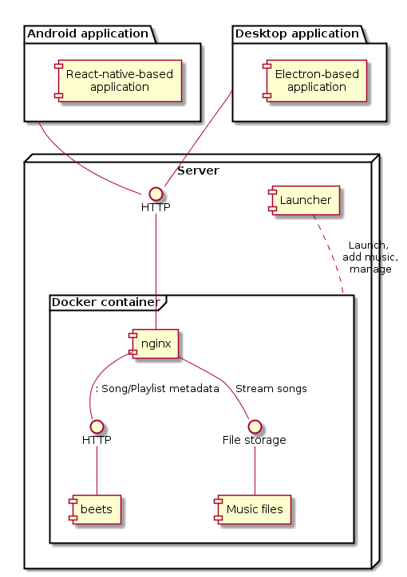

Radio Stream - Development repository
====================================

**NOTE:** These instructions are intended for developers of Radio Stream - If you just want to listen to music [go here](https://github.com/vitalybe/radio-stream-cli).

About
=====
**Radio Stream** is your personal music service that streams music automatically based on your listening habits.

* **Your music** - Use your own music files without restrictions.
* **Automatic DJ** - Enjoy music immediately without choosing a specific song or album. The music is selected based on when you last heard it, its rating and more. Read more [below](#automatic-dj).
* **Dynamic playlists** - Want to hear only some of your music? Create a music playlist, e.g, only with genre Heavy Metal, and have the automatic DJ stream the music from that station.
* **Desktop and Mobile clients** - Listen to your music when you're on another computer or on your mobile phone.
* **Last.FM support** - Scrobble your music to Last.FM
* **Powered by beets** - Use the super-powerful [beets](https://github.com/beetbox/beets) and all its plugins to organize your music. 

You can read additional details and installation instructions [here](https://github.com/vitalybe/radio-stream-cli).

  

Architecture
============

Overview
---------

 

Server
------
Composed of 2 main components.

**Docker container**

Docker was used to provide easy deployment and minimize required configuration for the user. It consists of the following subcomponents:
* beets - A [fork of beets](https://github.com/vitalybe/beets) that adds a specialized plugin for generating automatic playlists, updating play counts, ratings, etc. The plugin by default is listening for HTTP requests on internal port.
* nginx - Exposes a single HTTP endpoint for clients. Based on the incoming URL it either serves as proxy for beets or exposes the underlying music files.

**Launcher ([radio-stream-cli](https://github.com/vitalybe/radio-stream-cli))**

This is the server-side application that the user interacts with to control the docker container and execute beets inside it.

Client applications
-------------------

* Android application - Developed using react-native.
* Desktop application - Developed with electron. 

Development
===========

Getting started
---------------
    git clone --recursive https://github.com/vitalybe/radio-stream
    cd readio-stream
    # Prepare test hooks
    cp scripts/pre-commit .git/hooks/pre-commit

Then proceed to a specific folder and follow its readme:

* Server - "[server](https://github.com/vitalybe/radio-stream/tree/master/server)" folder. 
* Desktop application - "[web](https://github.com/vitalybe/radio-stream/tree/master/web)" folder. 
* Android application - [mobile](https://github.com/vitalybe/radio-stream/tree/master/mobile)" folder. 

Contributions
=============

Pull requests are most welcome. The main areas of focus I would love to see this project expand:

* Ability to create automatic playlists from clients.
* Ability to add music from clients - Currently requires to copy files to the computer running the server and running beet import funcionality.
* Unify web and mobile codebases - Since both electron and react-native rely on javascript, some code elements can be shared between the projects.
* Windows support - Should be relatively easy to do since electron supports windows already. Mac specific code is very minimal.
* Web-only mode - The native parts in this application are minimal so this shouldn't be too hard.
* iPhone support
